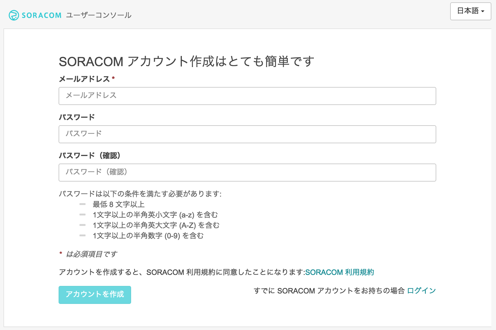
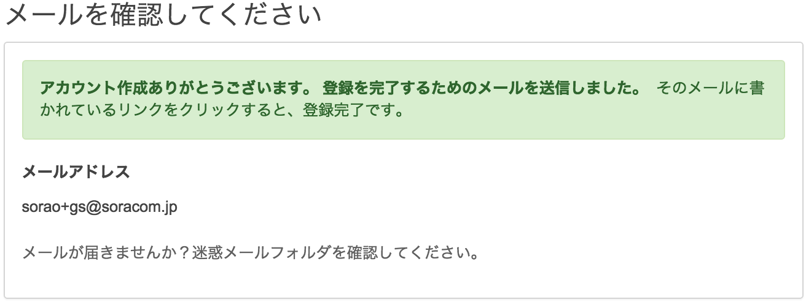
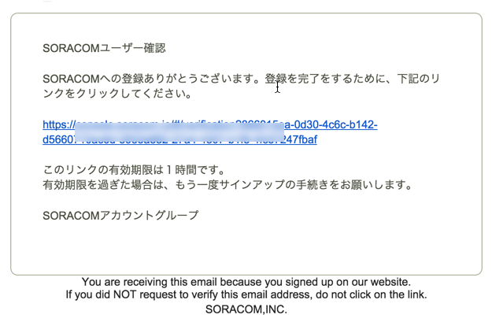
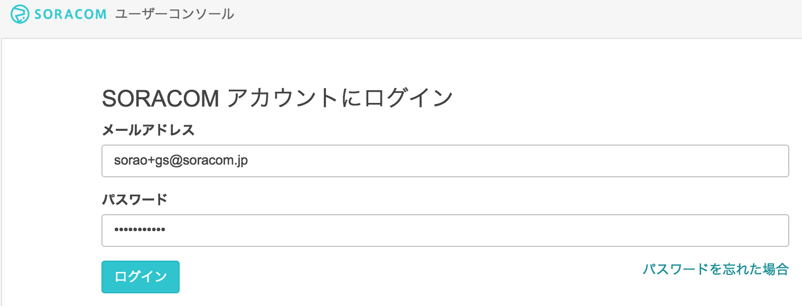
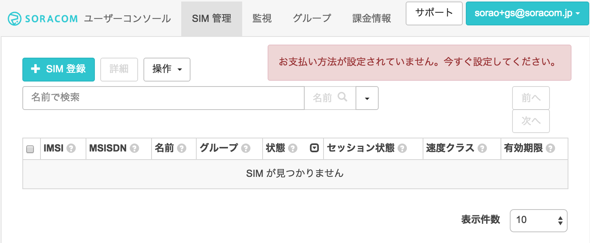
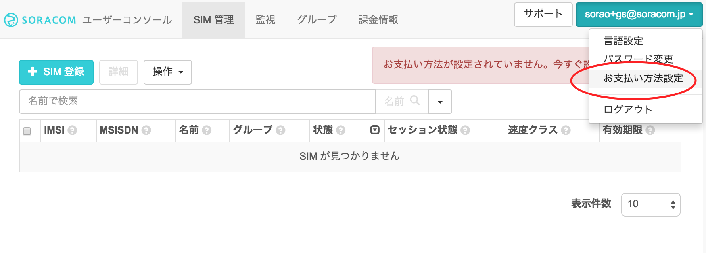
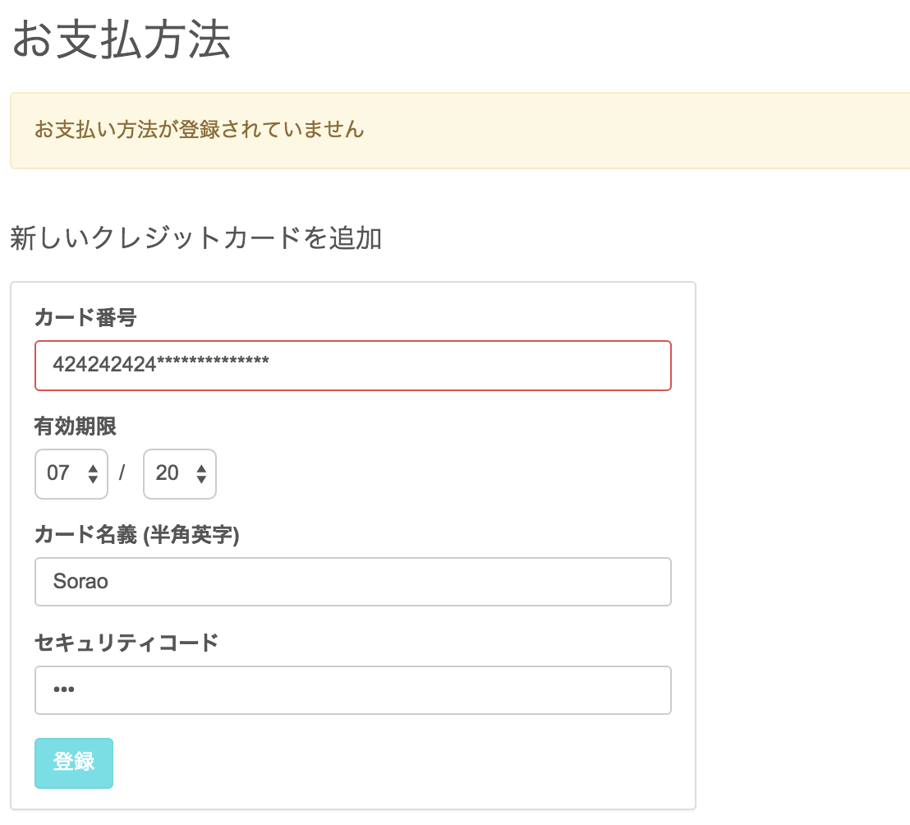
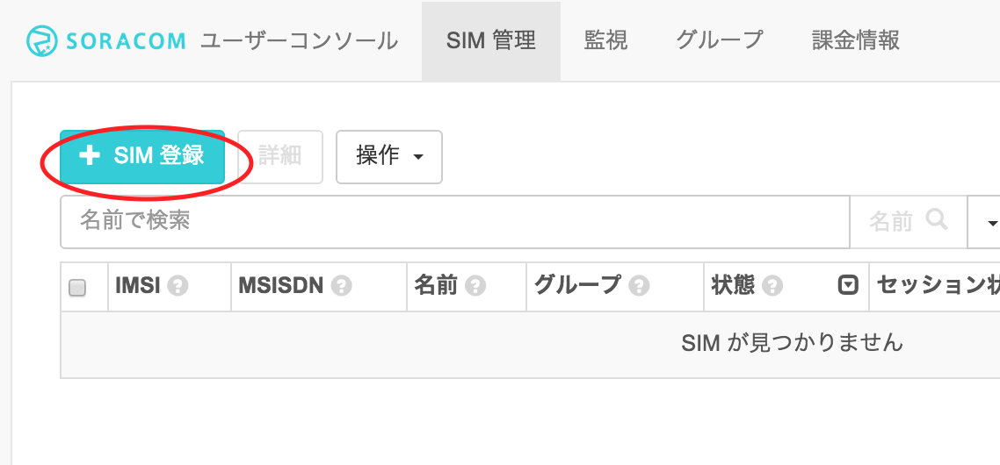
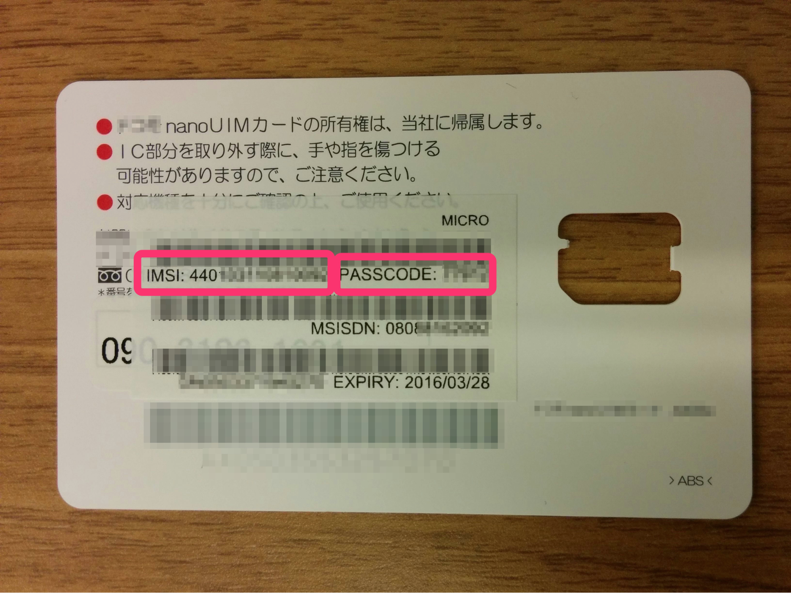
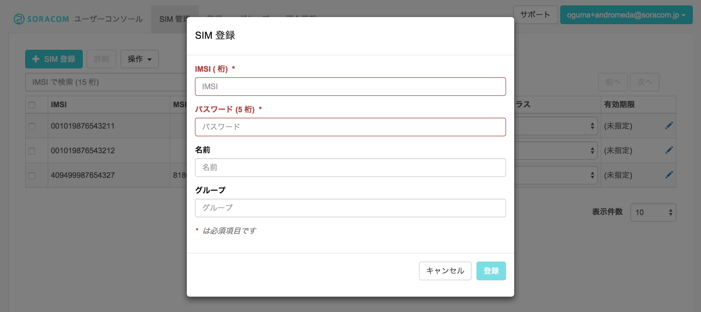

=================
 SORACOM Air設定
=================

SORACOM アカウントの作成
======================
ユーザーコンソールをご利用いただくためには、まずSORACOM アカウントを作成してください。
https://console.soracom.io/#/signup にアクセスします。

「アカウント作成」画面が表示されますのでメールアドレスおよびパスワードを入力して、[アカウントを作成] ボタンをクリックします。

複数人で管理を行う場合は、事前にメーリングリストのアドレスを取得するなど、共有のメールアドレスをご利用ください。

下記の画面が表示されるので、メールを確認してください。

メールが届いたらリンクをクリックしてください。

自動的にログイン画面に遷移しますので、メールアドレスとパスワードを入力してログインしてください。

ユーザーコンソールへのログイン
===========================

ログイン画面が表示されるので、アカウント作成時に登録したメールアドレスとパスワードを入力し、 [ログイン] ボタンをクリックしてください。(ログイン画面が表示されない場合はブラウザで https://console.soracom.io にアクセスします。)

以下の様な「SIM 管理」画面が表示されたらログイン完了です。引き続き、支払い情報の設定に進みましょう！

支払情報の設定
============

通信料の支払い方法はクレジットカードになります。クレジットカードの情報を登録するには、メイン画面上部のユーザー名から[お支払い方法設定]を開きます。

お支払い方法設定

お支払方法で各情報を入力し、支払い方法を登録します。

Air SIM の登録
=============
ユーザーコンソールにログインして、Air SIM の登録を行います。左上の [SIM登録] ボタンをクリックします。

「SIM登録」画面で、Air SIM の台紙の裏面に貼ってある IMSI と PASSCODE を入力してください。

名前、グループは空欄のままでも構いません。[登録] を押して SIM 登録を完了してください。複数の Air SIM を続けて登録することも可能です。

Air SIM を登録した直後の状態は「準備完了 (Ready)」と表示され、通信可能な状態になっています。初めて通信を行ったり、コンソールもしくは API で使用開始 (Activate) 処理を行うことで、状態は「使用中 (Active)」に変わります。 出荷前など、まだ通信を行いたくない場合は、コンソールもしくは API で休止 (Deactivate) 処理を行ってください。これにより「休止中 (Inactive) 」の状態となり通信は行われません。

端末の設定
=========

ご利用になられる端末 (スマートフォンや IoT デバイス) に Air SIM を挿入してください。その後、下記のパラメータで通信設定を行ってください。

- APN: soracom.io
- ユーザ名: sora
- パスワード: sora

設定後、実際にデータ通信可能かどうか確認してください。通信できていれば、初期設定は完了です。これで、インターネットに接続できます。おめでとうございます！

その他の操作について
==================

下記ページに、コンソールからの通信速度変更等の操作についてご案内がありますので、ぜひご確認ください。

- `ユーザーコンソールを使用してSIMを管理する <https://dev.soracom.io/jp/start/console/>`_
