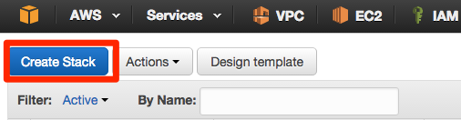

=================
 AWS IoT基本設定
=================

デバイスの作成
==============

AWSマネージメントコンソールへログインし、画面右上のメニューから東京リージョンを選択します。
サービス一覧から"AWS IoT"をクリックします。

.. image:: images/awsiot-servicemenu.png

|

“Get Startedが表示される場合はそちらをクリックします。

.. image:: images/awsiot-getstart.png

|

デバイス(Thing)を作成します。メニューの”Create a thing”をクリックします。Nameに”edison”と入力し、[Create]をクリックします。

|

リソースの一覧で作成したデバイスが表示されます。

|

証明書の作成
============

メニューの”Create a certificate”をクリックし、[1-Click Certificate Create]をクリックします。

|

Download ~をクリックして、Public Key、Private Key、Certificateをそれぞれダウンロードします。

|

画面下の作成した証明書をクリックし、画面右のActionsリストから[Activate]を選びます。

|           

”ACTIVE”になったことを確認します 。

|           

ポリシー作成
============

デバイスに対して、AWS IoTの各種操作を許可するためのポリシーを作成します。メニューの”Create a policy”をクリックします。フォームにそれぞれ以下のパラメータを入力し、[Create]をクリックします。

============= ============================
項目          値
============= ============================
Name          awsiot-handson-policy
Action        iot:*
Resource      * (アスタリスク)
============= ============================

|

.. image:: images/awsiot-create-policy.png

|

作成したポリシーがリソースの一覧に表示されます。

.. image:: images/awsiot-policy.png

先ほど作成した証明書をポリシーに割当てます。リスト中の証明書をクリックし、[Actions]-[Attach a policy]をクリックしてください。

.. image:: images/awsiot-attach-policy.png

|

“Confirm”の画面で、フォームにポリシー名”awsiot-handson-policy”を入力し、[Attach]をクリックします。

.. image:: images/awsiot-attach-policy-2.png

|

次に、デバイスと証明書の関連付けを行います。作成した証明書をリソース一覧の中から選択し、[Actions]-[Attach a thingクリックしま
す。

.. image:: images/awsiot-attach-thing.png

|

"Thing Name"にデバイス名: **bx1** を入力し、[Attach]をクリックします。

           
DynamoDBのテーブル作成(CloudFormation)
======================================

ハンズオンで利用するDynamoDBテーブルを作成を自動化するために、CloudFormationのスタックを作成します。

|

マネージメントコンソールのサービス一覧から"Cloud Formation"をクリックします。

|

"Choose a template"から"Specify an Amazon S3 template URL"にチェックを入れ、以下のパスを入力し、[Next]をクリックします。

https://s3-ap-northeast-1.amazonaws.com/awsiot-handson-jp/dynamodb.template

|

"Stack Name"に"IoTHandsonStack"と入力し、[Next]をクリックします。

|

"Options"で何も入力せずに[Next]をクリックします。

|

"Review"で[Create]をクリックします。

|

Cloud Formationのスタックの一覧に作成したスタックが表示されるのを確認します。Statusは"CREATE_IN_PROGRESS"から"CREATE_COMPLETE"になるのを確認します。

|

|

           
ルール作成
==========

到着したセンサーデータをDynamoDBにストアするように設定します。

AWS IoTのサービス画面を開き、"Create a resource"をクリックし、"Create a rule"をクリックします。"Create a rule"の画面で以下の設定値を入力します。

============= ============================
項目          設定値
============= ============================
Name          IoTHandsonRule
Description   任意
Attribute     *(アスタリスク)
Topic Filter  handson/device01
Condition     入力しない
============= ============================

|

|
           
画面をスクロールし、"Choose an action"から"Insert a message into a Database table(DynamoDB)"を選択します。以下の値を入力します。"Role Name"では[Create a new policy]をクリックします。

|

=========================== ===========================
設定項目                    値
=========================== ===========================
Table Name                  IoTHandsonRawData
Hash Key Value              ${topic(2)}
Range Key Value             ${timestamp()}
Payload  Field              value
=========================== ===========================

|

|

AWS IoTからDynamoDBへデータをPutするためのRoleを作成します。以下の画面で[Allow]をクリックします。

|

[Add Action]をクリックします。

|

"DynamoDB Action"が追加されたことを確認したら、[Create]をクリックします。

|

リソースの一覧に作成したルールが作成されたことを確認します。

           
           
