=======================
OpenBlocks IoT BX1 設定
=======================

本章ではOpenBlocks IoT BX1 (以下 BX1) を使用し、センサーデバイス "CC2541" のデータを "SORACOM Air" の回線で "AWS IoT" に送信するところまでの設定を行います

TODO: 目次

BX1の取り扱い (電源ON/OFF・再起動、SIM挿入)
===========================================

BX1は給電開始と共に電源ONとなります。USBケーブルを接続すると起動開始です

INITボタンや電源ボタンはOSのシャットダウンと再起動に利用されますので、必要時以外は押さないでください

部位の名前やSIM挿入方法については、下記を参照してください

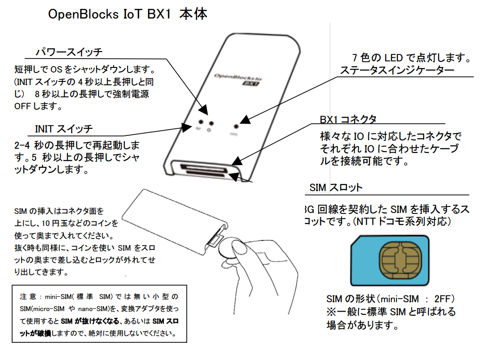

(`OpenBlocks IoT Family WEB UI セットアップガイド P7 <http://openblocks.plathome.co.jp/common/pdf/OpenBlocksIoTSeriseSetupGuide1_0_5.pdf#page=7>`_ より抜粋)

ステータスインジケータ (LEDの表示色)
------------------------------------

BX1は *STATUS* のLEDにて状態を把握することができます

本ハンズオンにおいては、起動後は **白色、水色、青色** が望ましく、それ以外の色の場合は不具合がある可能性がありますので、チューターにご相談ください

具体的なLED色と状態については、下記を参照してください

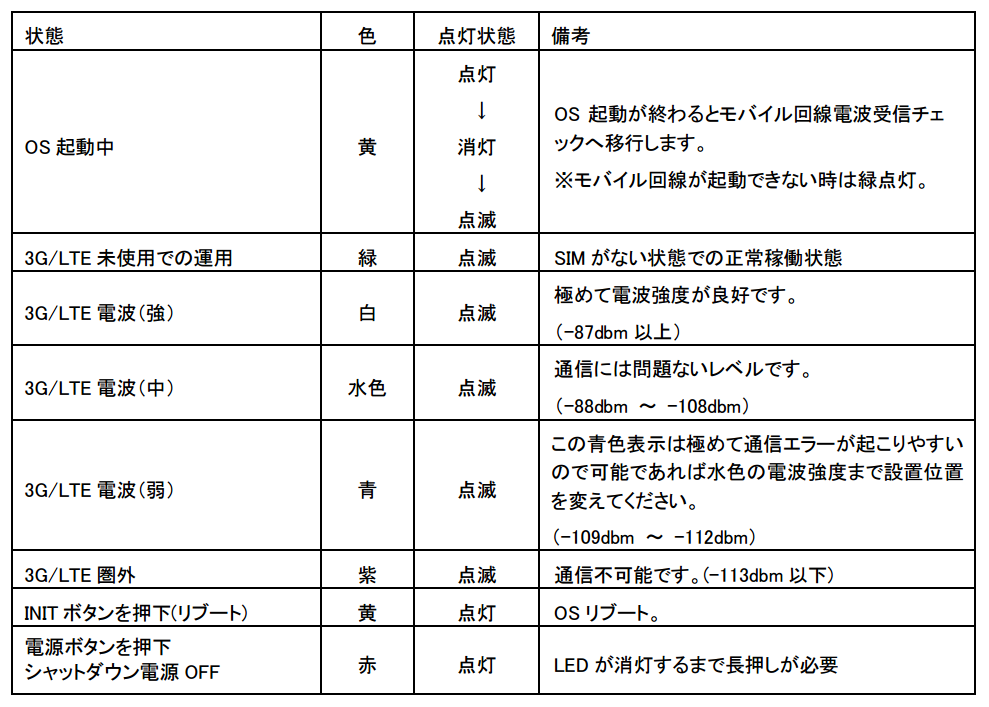

(`OpenBlocks IoT Family WEB UI セットアップガイド P7 <http://openblocks.plathome.co.jp/common/pdf/OpenBlocksIoTSeriseSetupGuide1_0_5.pdf#page=7>`_ より抜粋)

Web管理画面(WebUI)の表示とログイン
==================================

**注意:** BX1に接続したPCやスマートフォンは、BX1のWi-Fiに接続している限り、後ほど設定するSORACOM Airの設定が終わるまではインターネットに接続することが出来ません。また、SORACOM Airの設定が完了すると、インターネットへのアクセスは "PC =[wi-fi]=> BX1 =[SORACOM Air]=> インターネット" という経路になり、 **通信料が発生する可能性があります** ので、Dropbox等の共有ソフトの動作をOFFにすることを **強く推奨いたします**

BX1とWi-Fiで接続する
--------------------

BX1起動が完了すると、BX1はWi-Fiのアクセスポイントとして動作を開始します

お手持ちのPCやスマートフォンから SSID を探し、接続してください

- SSID: ``_ホストID_1121handson``
- Password: ``ホストID``

802.11g, WPA2-PSK の設定で接続できます

お手持ちのBX1のホストID確認方法
~~~~~~~~~~~~~~~~~~~~~~~~~~~~~~~

ホストIDは、BX1のウラ面のバーコード上の文字と数字の組み合わせになります

下記例では **F2A00788** がホストIDです (そのためSSIDは **_F2A00788_1121handson** となります)

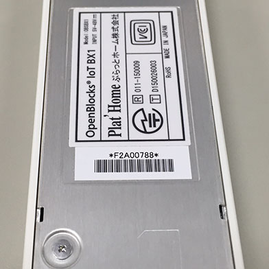

WebUIを表示する
---------------

BX1にWi-Fiで接続できたら、下記URLにてWebUIを表示します

http://192.168.254.254:880

下記の画面が出れば正常に接続ができています

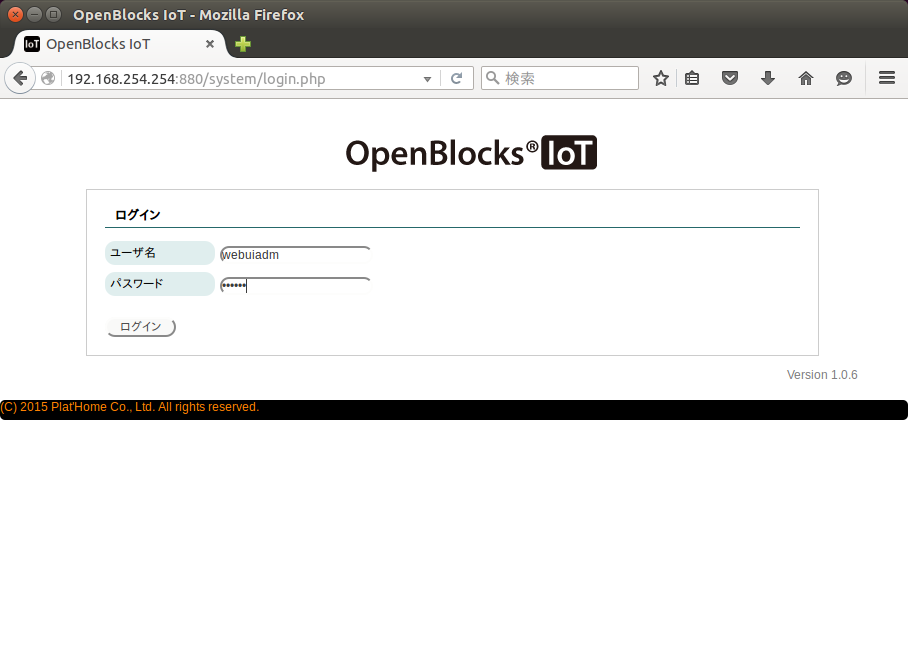

WebUIにログインする
-------------------

WebUIは下記IDとパスワードでログインできます

- ID: webuiadm
- Password: 0BSI0T (ゼロ ビー エス アイ ゼロ ティー)

ログインに成功すると、下記画面が表示されます

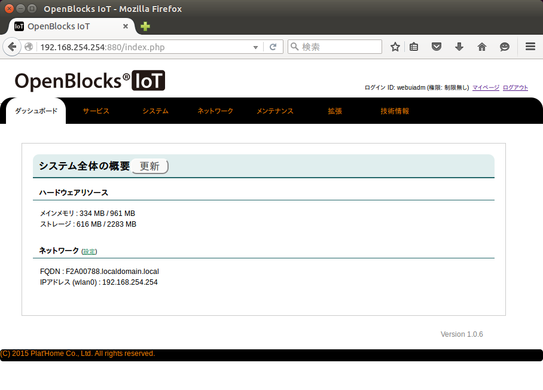

CC2541をデバイスとして登録し、動作の確認をする
==============================================

Bluetoothの使用を開始する
-------------------------

#. WebUIから [サービス] - [基本] を表示
#. *Bluetooth* の使用設定を **使用する** にして [保存]

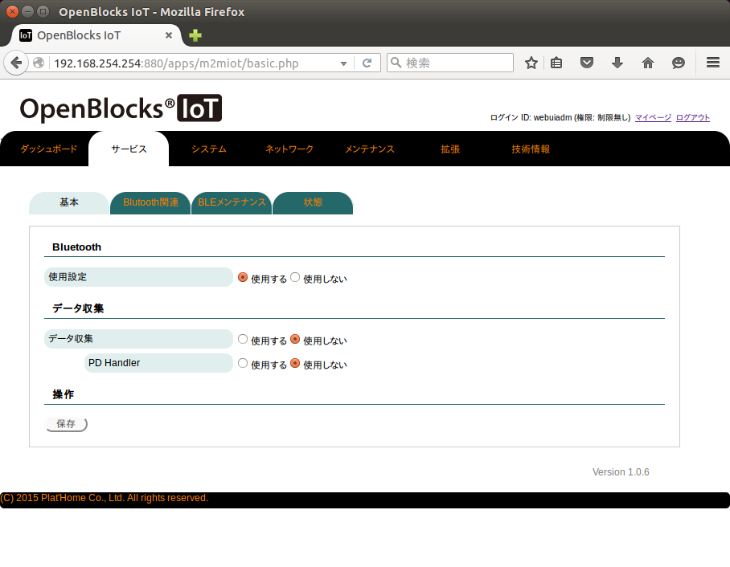

CC2451を検出して使用できるようにする
------------------------------------

#. WebUIから [サービス] - [Bluetooth関連] を表示
#. **Bluetooth LEデバイス検出** の [検出] をクリック
#. 一覧の中から自分のデバイスを探し **使用設定** にチェックをして [保存]

※ Bluetooth デバイス検出の方でなく、 **Bluetooth LEデバイス検出** を押すようにしてください

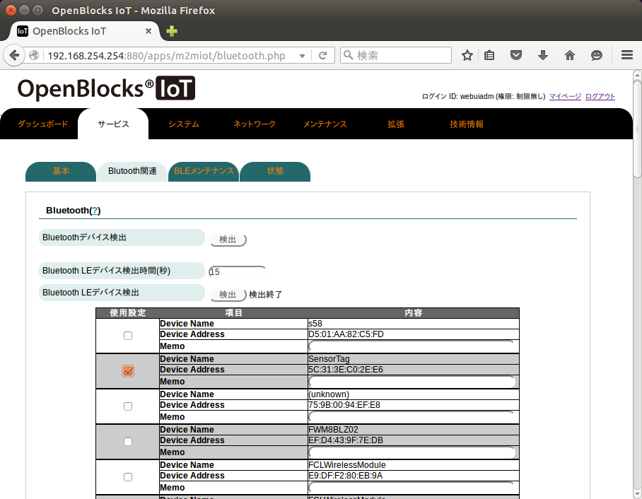

自分のデバイスの探し方
~~~~~~~~~~~~~~~~~~~~~~

Device Name = SensorTag が大量に表示される可能性があります

お配りした CC2541 にはアドレスのタグが書かれており、画面上に表示されている *Device Address* と一致したものが、ご自分の CC2451 となります

赤いカバーをはがすと、下記のようにアドレスが記載されています (タグにはコロン文字が記載されていません)

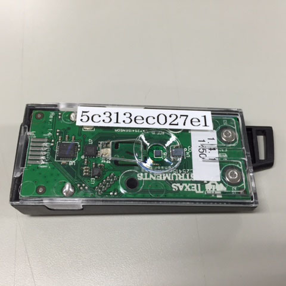

確認
----

保存すると WebUI は下記のようになります

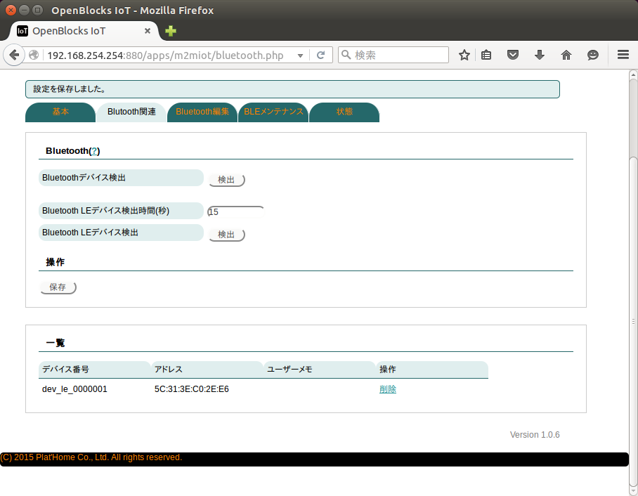

ローカルへのデータ収集設定
==========================

AWS IoTへの送信の前に、まず CC2541 からのデータ収集ができているか確認をします

BX1のデータ収集機能を開始する
-----------------------------

#. WebUIから [サービス] - [基本] を表示
#. **データ収集** における **データ収集** ならびに **PD Handler** をそれぞれ **使用する** にして [保存]

※ "PD Handler" は "データ収集" を <使用する> にすると表示されます

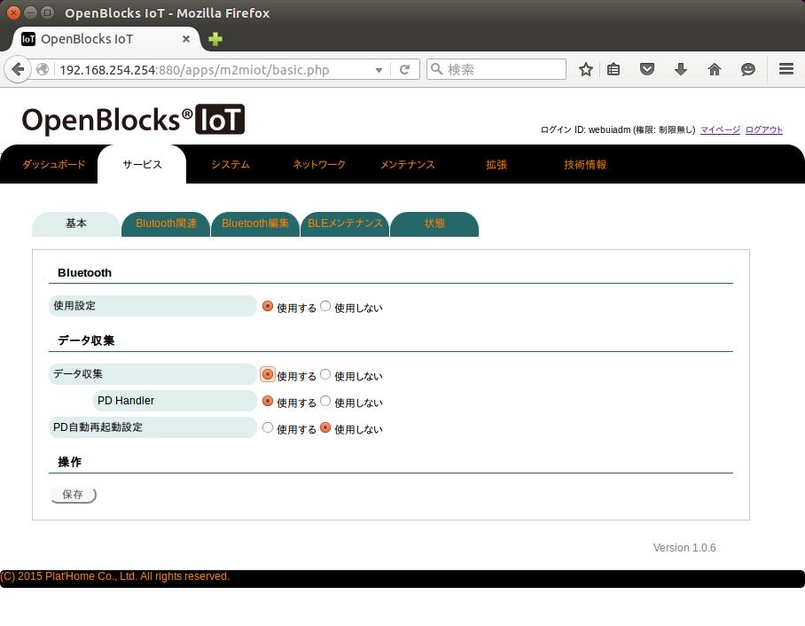

注意: データ収集を開始すると、新たにデバイス登録をすることができなくなります。デバイス登録をする場合は、まず、データ収集を行わないように設定を変更してください

BX1内へのデータ収集機能を開始する
---------------------------------

#. WebUIから [サービス] - [収集設定] を表示
#. **本体内(local)** を **使用する**

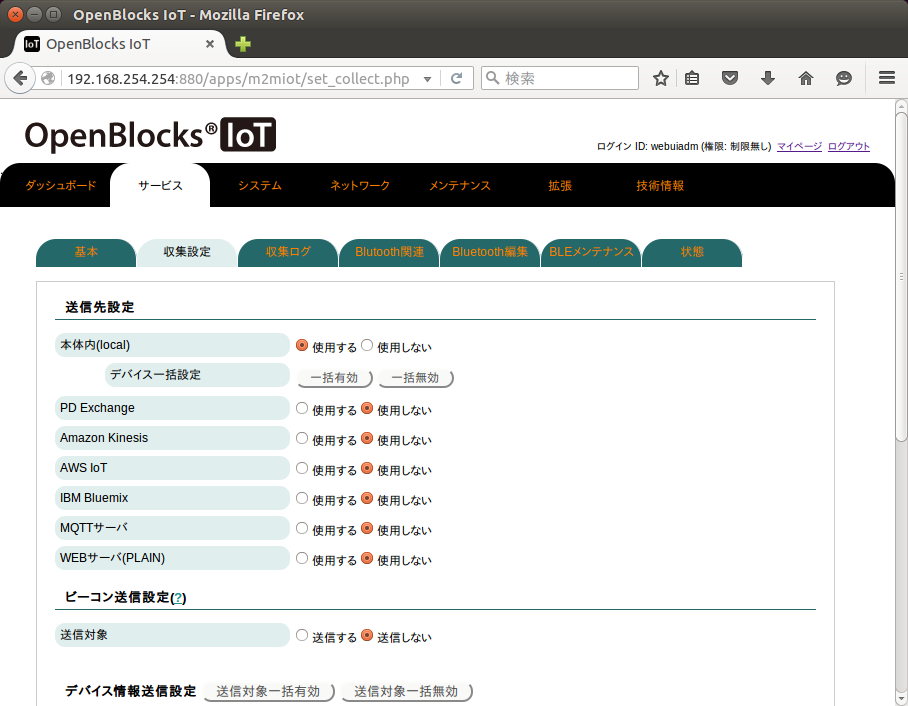

ページ後半に移動し **dev_le_0000001** の設定を下記のようにします

#. **送信対象** を **送信する**
#. **送信先設定** を **local** にチェック
#. 以上を確認し [保存]

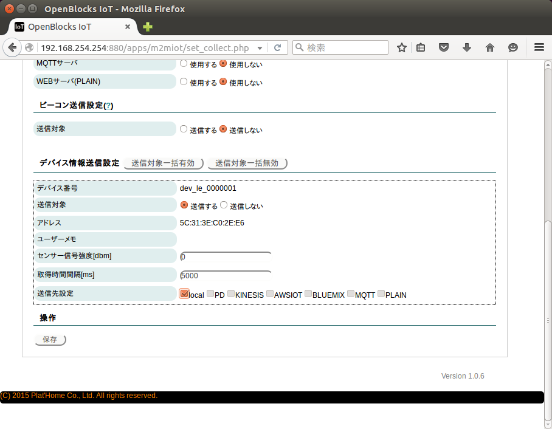

グラフの表示
~~~~~~~~~~~~

localへのデータ収集が開始されると、WebUI内のグラフに表示が開始されます

[サービス] - [データ表示] にて確認できます

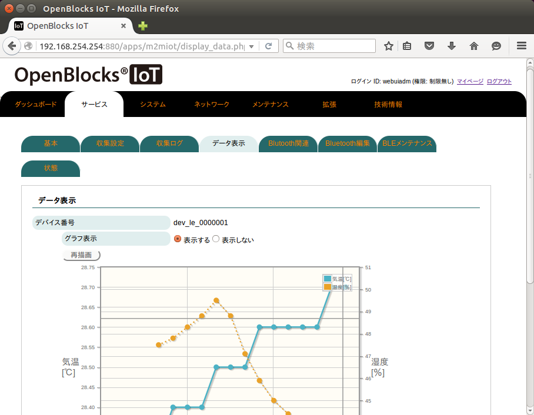

うまく表示されない場合は、後述の データ収集状況の確認 で確認します

