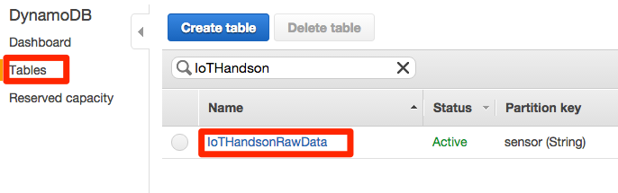
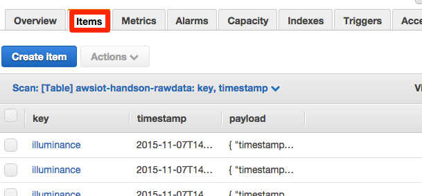

==================
データ送信確認
==================

BX1からデータが正常に送信されているかを確認します。

AWSマネージメントコンソールから"DynamoDB"をクリックします。左のメニューから"Tables"をクリックし、リストからテーブル名"IoTHandsonRawData"をクリックします。

画面右から"Items"タブをクリックし、テーブルにセンサーから受信したデータが保存されていることを確認します。

           
